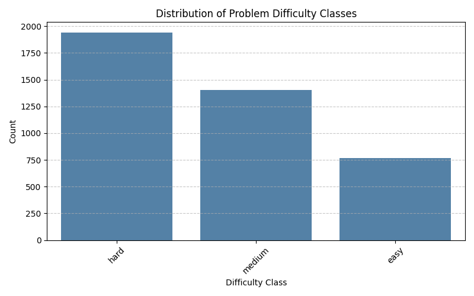
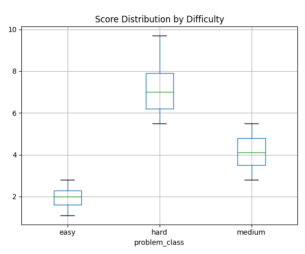
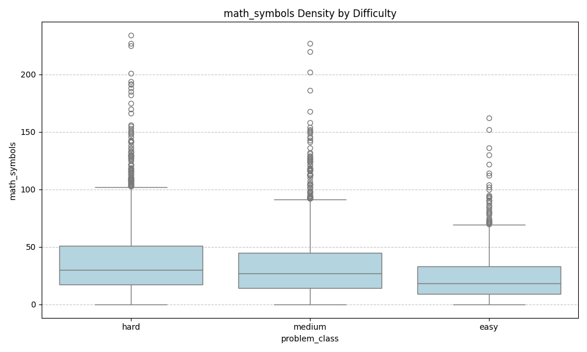
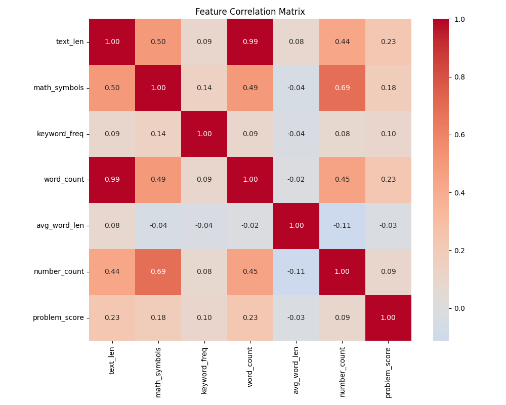
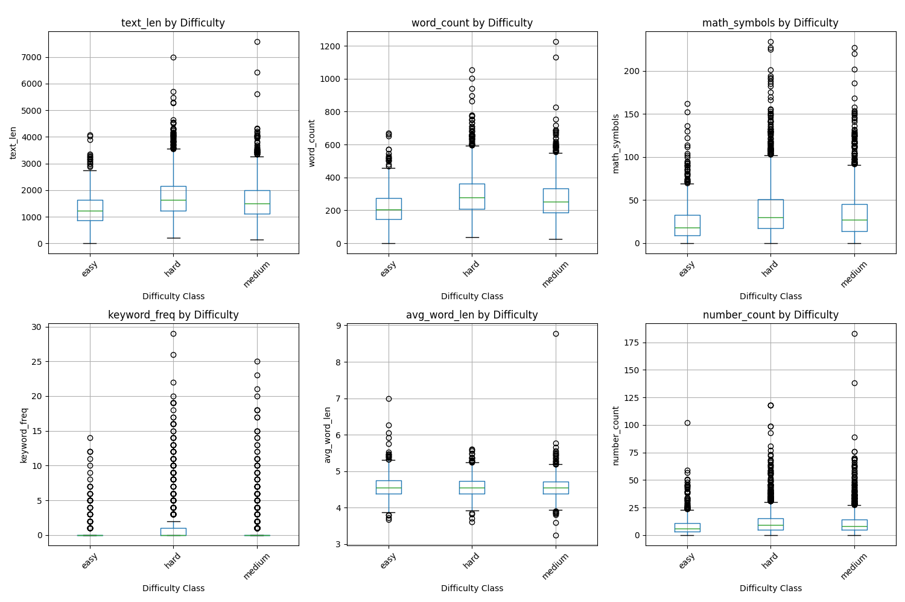
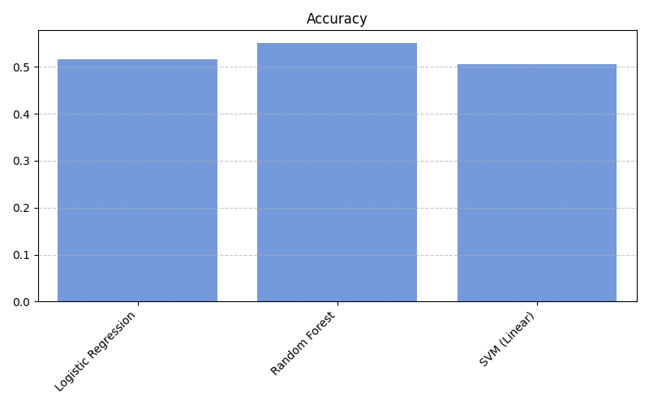
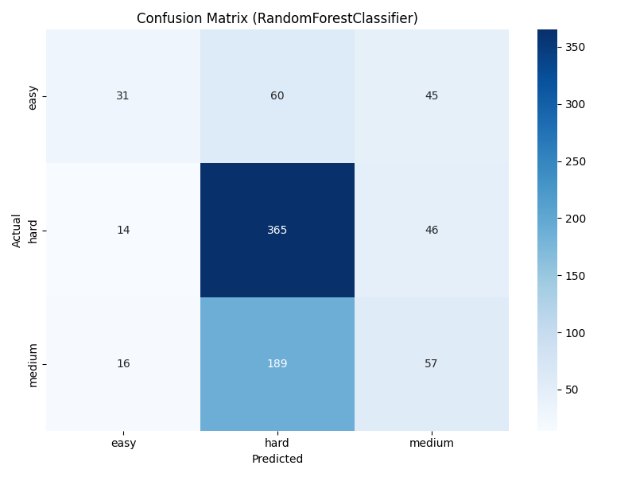
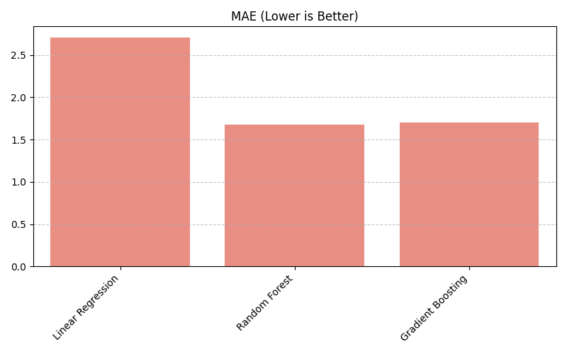
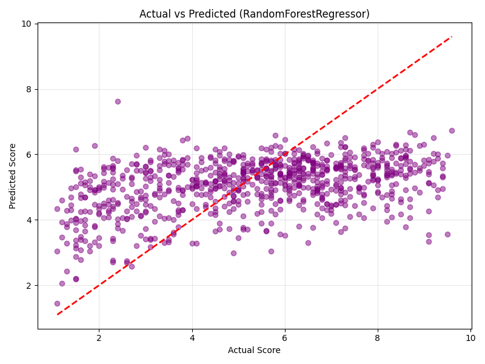

# AutoJudge: Automated Programming Problem Complexity Analysis


**AutoJudge** is a Machine Learning system designed to automate the difficulty assessment of competitive programming problems. By analyzing the textual description of a problem (specifically its linguistic structure, mathematical density, and algorithmic terminology) the system predicts both its **Categorical Difficulty** (Easy, Medium, Hard) and a **Numerical Difficulty Score**.

This project eliminates the subjectivity of manual problem tagging by providing a data-driven, consistent scoring engine.

---

## 📖 Table of Contents
1.  [Project Overview](#-project-overview)
2.  [Demo Video](#-demo-video)
3.  [Dataset & Preprocessing](#-dataset--preprocessing)
4.  [Feature Engineering](#-feature-engineering-strategy)
5.  [Model Selection & Methodology](#-model-selection--methodology)
6.  [Experimental Results](#-experimental-results)
7.  [Web Interface](#-web-interface)
8.  [Installation & Usage](#-installation--usage)
9.  [Project Structure](#-project-structure)

---

## 🔭 Project Overview

Online coding platforms require accurate difficulty tags to guide users. AutoJudge solves this by implementing a **Natural Language Processing (NLP)** pipeline that:
1.  **Ingests** raw problem statements (Title, Description, Input/Output).
2.  **Extracts** metadata regarding mathematical complexity and constraints.
3.  **Predicts** the classification and rating using an Ensemble of Random Forest models.

The system is deployed via a modern **Streamlit Web Interface** allowing for real-time inference.

---

## 🎥 Demo Video

> ****
>
> *Duration: 2-3 Minutes*
> *Overview of Architecture, Model Training, and Web UI Demonstration.*

---

## 📊 Dataset & Preprocessing

I trained the system on a dataset of **4,112 competitive programming problems**.

### Data Distribution
An initial Exploratory Data Analysis (EDA) revealed the following class distribution:
*   🔴 **Hard:** 1,941 samples
*   🟠 **Medium:** 1,405 samples
*   🟢 **Easy:** 766 samples

<p align="center">
  
  <br>
  <em>Figure 1: Distribution of Problem Difficulty Classes (Imbalanced Dataset).</em>
</p>

### Score Distribution
I analyzed the numerical difficulty scores to understand the spread. Missing scores were imputed using the median (**5.2**).

<p align="center">
  
  <br>
  <em>Figure 2: Histogram and Boxplot of Numerical Scores.</em>
</p>

---

## 🧠 Feature Engineering Strategy

To capture the specific nuance of algorithmic difficulty, I used a **Hybrid Feature Extraction** approach. The model does not rely solely on text vectors but also on engineered meta-features.

### 1. Feature Correlation Analysis
I extracted 6 key features: `text_len`, `math_symbols`, `keyword_freq`, `word_count`, `avg_word_len`, and `number_count`.

<p align="center">
  
  <br>
  <em>Figure 3: Boxplot showing Hard problems contain significantly more Math Symbols ($).</em>
</p>

<p align="center">
  
  <br>
  <em>Figure 4: Correlation Matrix of all engineered features vs Problem Score.</em>
</p>

<p align="center">
  
  <br>
  <em>Figure 5: Detailed breakdown of all 6 meta-features by Difficulty Class.</em>
</p>

---

## ⚙️ Model Selection & Methodology

I implemented a **Comparative Analysis Pipeline** (Battle Royale) to test multiple algorithms for both Classification and Regression tasks. The dataset was split into **80% Training** and **20% Testing** sets.

### Classification Models Tested:
1.  **Logistic Regression:** Baseline linear model.
2.  **Support Vector Machine (Linear SVC):** High-dimensional margin optimizer.
3.  **Random Forest Classifier:** Ensemble decision tree method.

### Regression Models Tested:
1.  **Linear Regression:** Baseline.
2.  **Gradient Boosting Regressor:** Sequential error correction.
3.  **Random Forest Regressor:** Non-linear ensemble method.

---

## 🧪 Experimental Results

After extensive training, I selected the **Random Forest** architecture as the champion model for both tasks due to its superior ability to capture non-linear feature interactions.

### Classification Performance
| Model | Accuracy | Status |
| :--- | :--- | :--- |
| **Random Forest** | **55.04%** | ✅ **Selected** |
| Logistic Regression | 51.64% | Rejected |
| SVM (Linear) | 50.55% | Rejected |

<p align="center">
  
  <br>
  <em>Figure 6: Accuracy comparison of Classification models.</em>
</p>

<p align="center">
  
  <br>
  <em>Figure 7: Confusion Matrix of the final Random Forest Classifier.</em>
</p>

### Regression Performance
| Model | MAE (Mean Absolute Error) | RMSE | Status |
| :--- | :--- | :--- | :--- |
| **Random Forest** | **1.68** | **2.02** | ✅ **Selected** |
| Gradient Boosting | 1.70 | 2.04 | Rejected |
| Linear Regression | 2.70 | 3.37 | Rejected |

<p align="center">
  
  <br>
  <em>Figure 8: Error Analysis (MAE) - Lower is better.</em>
</p>

<p align="center">
  
  <br>
  <em>Figure 9: Actual vs Predicted Scores (Closer to red line is better).</em>
</p>

---

## 💻 Web Interface

The project includes a **"Cosmic Glass" themed Web Application** built with Streamlit.

**Key Features:**
*   **Real-Time Inference:** Users paste problem text, and the system predicts difficulty instantly.
*   **Live Analysis Report:** Displays the predicted Class (with color coding), Score, and extracted Feature Metrics.
*   **Modular Backend:** The app imports logic directly from the `src/` module, ensuring consistency.

---

## 🛠️ Installation & Usage

**Prerequisites:** Python 3.8+

### 1. Clone the Repository
```bash
git clone https://github.com/YOUR_USERNAME/AutoJudge.git
cd AutoJudge
```

### 2. Install Dependencies
```bash
pip install -r requirements.txt
```

### 3. (Optional) Retrain Models
To run the full data pipeline and generate the graphs shown above:
```bash
python main.py
```

### 4. Run the Web App
```bash
streamlit run app.py
```
---

## 📂 Project Structure

The project follows a modular, industry-standard directory structure:

```text
AutoJudge/
├── app.py                 # Frontend Application (Streamlit)
├── main.py                # Pipeline Entry Point
├── requirements.txt       # Project Dependencies
├── src/                   # Source Code Module
│   ├── __init__.py
│   ├── features.py        # Feature Engineering Logic
│   ├── preprocessing.py   # NLP Cleaning Logic
│   ├── plotting.py        # Graph Generation Logic
│   ├── classification.py  # Classifier Training
│   ├── regression.py      # Regressor Training
│   ├── eda.py             # Data Analysis
│   ├── train.py           # Pipeline Controller
│   └── utils.py           # Logging & Config
├── data/                  # Dataset Storage
├── models/                # Serialized Model Artifacts
└── reports/               # Generated Graphs & Logs
```
---
